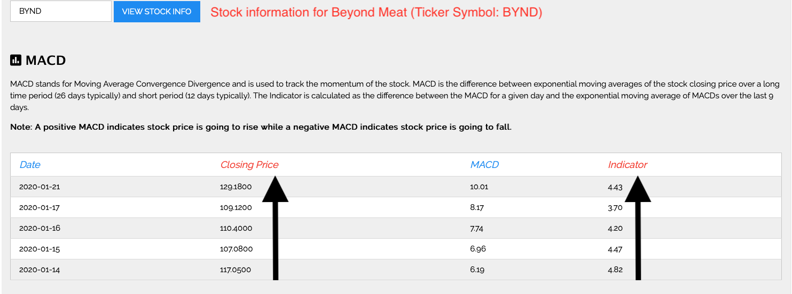
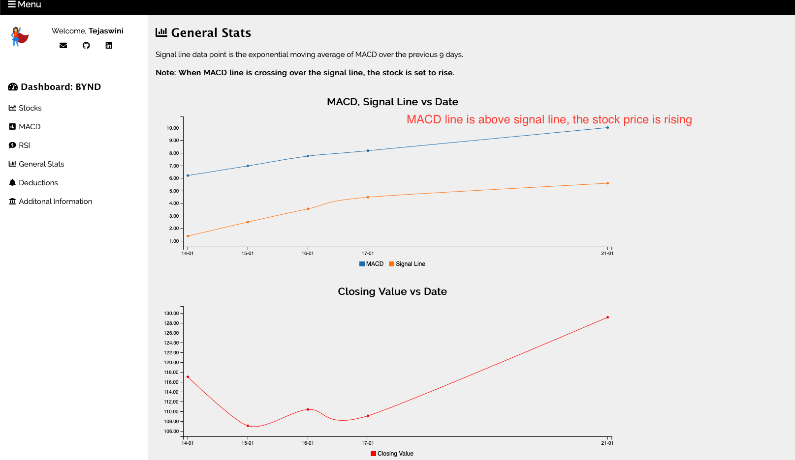
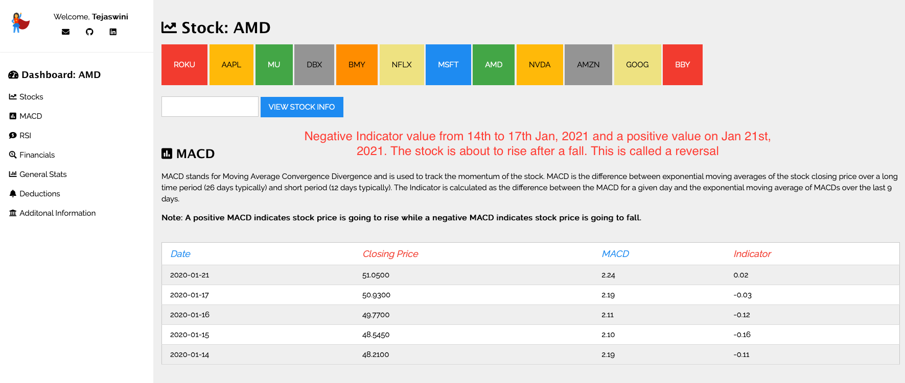
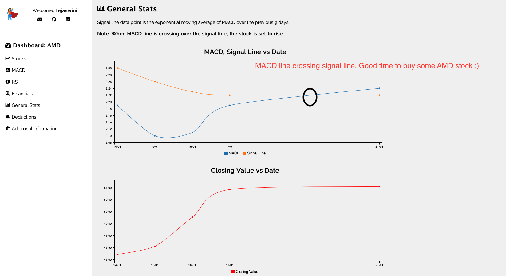

# Stock Information

### Table of Contents:

1. [Starting Up](#starting_up)

2. [Navigation Pane]

3. [MACD]

4. [RSI]

#### Starting Up (#starting_up)

On clicking the index.html file, the following page appears. The script is embedded in code.js file.

As seen above, the stocks with their symbols are represented as boxes. The pane can be created to monitor stocks part of the user's portfolio. On clicking the box with the corresponding stock symbol, the company MACD, RSI, Financials (if available) and deductions are displayed to the user. By default, a stock has been configured to display to the user on load. The default stock here is "BABA"

#### Navigation_Pane:

The Sidebar let's the user go directly to a certain section of the web page. The first option: Stocks, brings the user to the top of the page.

#### MACD

The Moving Average Convergence Divergence (MACD) is a momentum indicator of a stock which is used to visualize the stock price's momentum. MACD is calculated by calculating the difference between the exponential moving averages of the stock's closing price over a over a long time (typically 26 days) and short time (typically 12 days). The indicator value is the difference between the MACD value for a given date and the exponential moving average of MACD over the previous 9 days.

A positive Indicator value denotes the stock price is about to rise while the negative MACD denotes the stock is about to fall. The trend can be seen by observing the values of the stock as shown below.

In the above diagram, the stock price is clearly rising and the indicator value is going up accordingly.

Further evidence of the stock performance can be seen by visualizing the graph in the "General Stats" section:

Conversely, the stock can be seen as falling when the indicator value is negative. A reversal occurs when the MACD line crosses the signal line as shown below:

The stock of AMD has the following MACD values:

#### RSI

The relative strength index (RSI) is a momentum indicator that computes the strength of the stock. It measures the speed and change of price movements. RSI varies from 0 to 100. Typically, a stock is considered to be in overbought position when the RSI value is above 70, while the stock is considered to be in oversold position when the RSI falls below 30.
