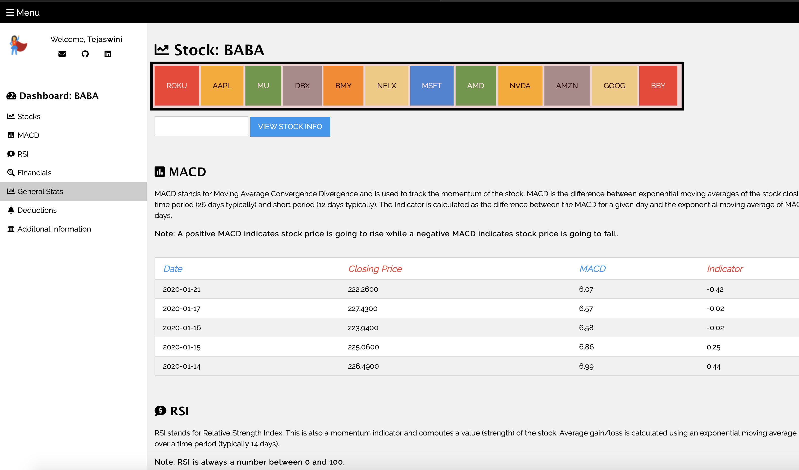

# Stock_Information
Web page to display stock profile
On load, the following screen appears.

As seen above, the stocks with their symbols are represented as boxes. The pane can be created to monitor stocks part of the user's portfolio. By default, a stock has been configured to display to the user on load. The default stock here is "BABA"

<b>MACD Section</b>

The Moving Average Convergence Divergence (MACD) is a momentum indicator of a stock, used to visualize, using data, the stock price's momentum to rise/fall.

